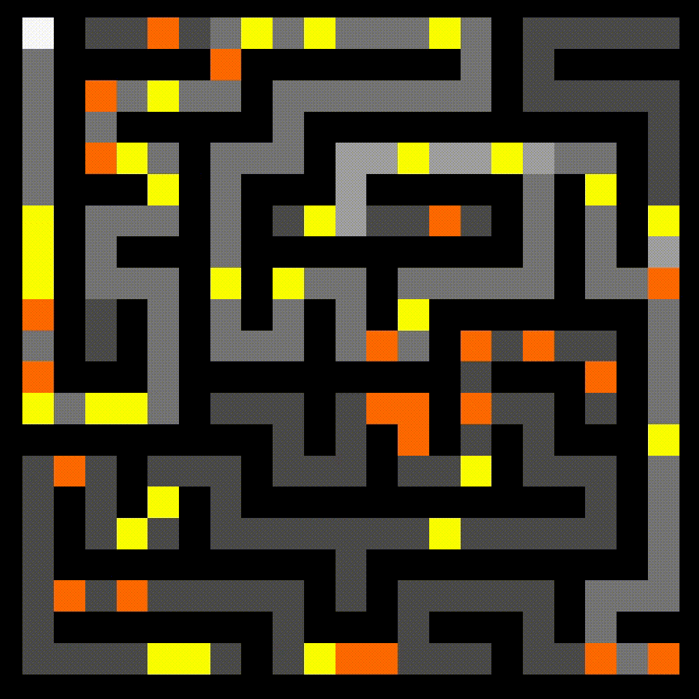
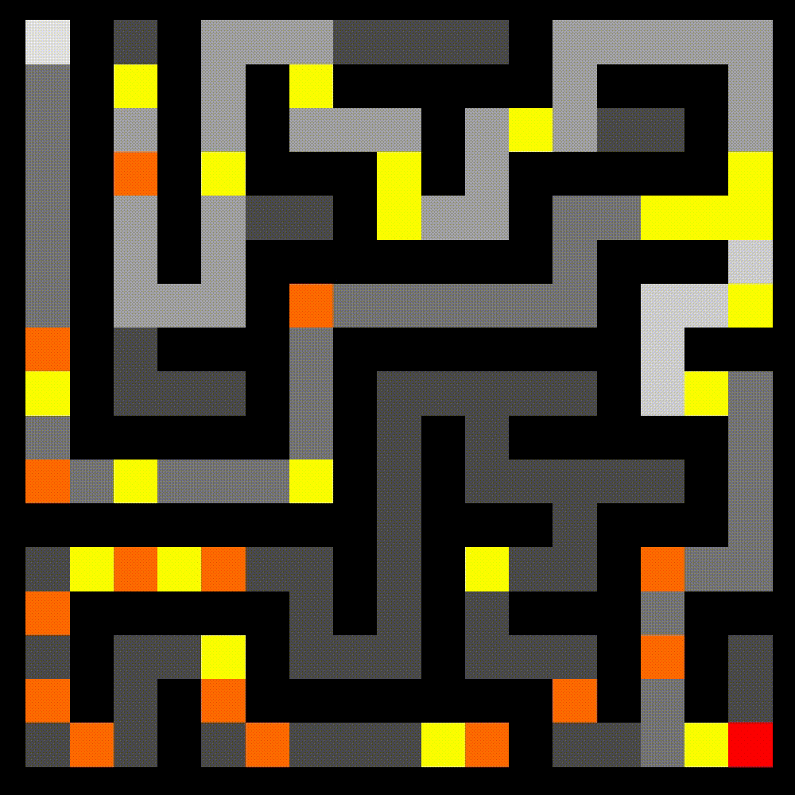
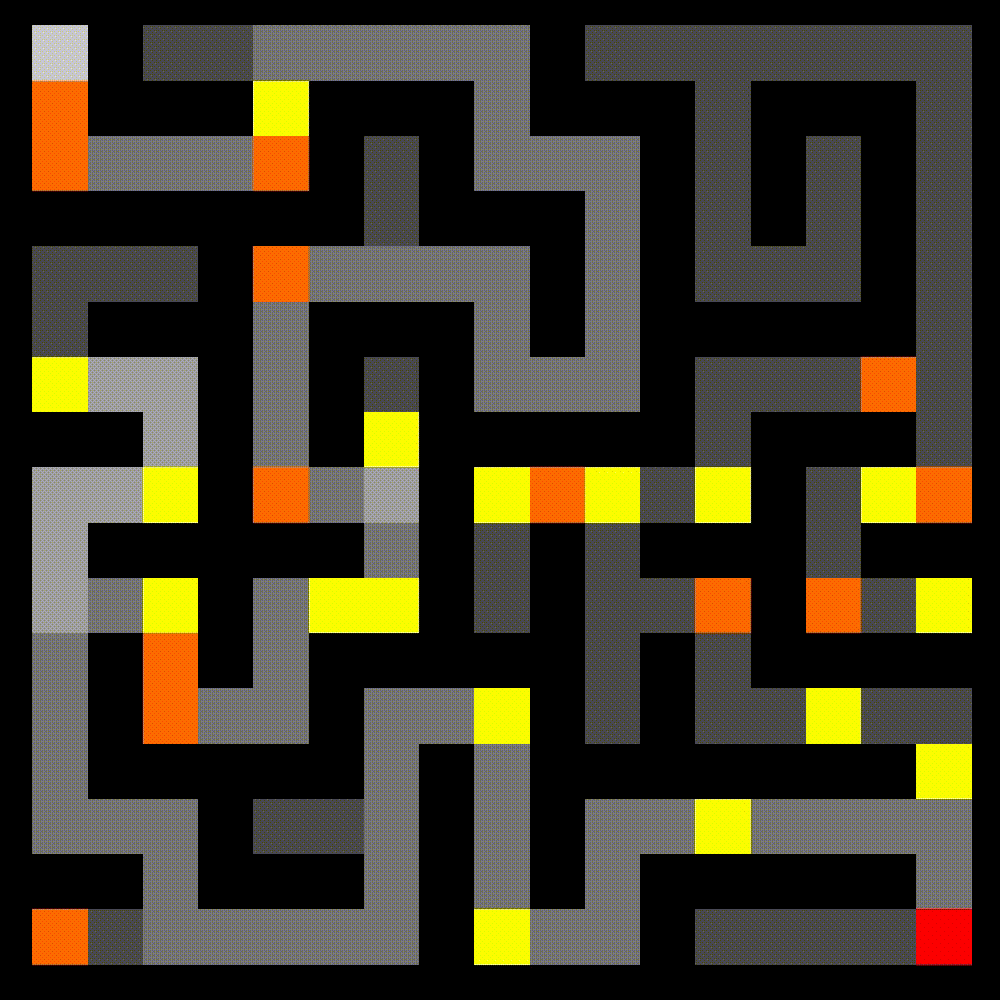
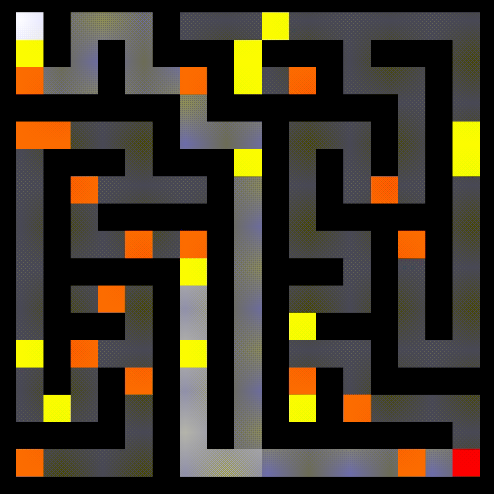

# Pathfinding with Q-Learning
*Gage Benne and Andrew Monroe*

Built in Apple's Swift programming language, we have developed a simple application that solves mazes with enemies and treasures, that is easily portable across the various Apple platforms.  Navigating the maze involves moving a player and a score system: less one point for every move made, 20 points for finding a treasure, and minus 5 for taking a path through an enemy.  We also wanted to allot a generous reward for actually completing the maze, around 500 points for reaching the end.  Of course, the greater the points, the better the player did.

## Strategy

We decided to utilize the Q-Learning strategy for solving our maze, which essentially combines a hash table of states (states being a struct of the node and what treasures / enemies are still present), where each value is a hash table of actions, that are each associated with some particular value based on how good that action is expected to be. The "Q-Table" is first randomly populated with values, then tuned and calibrated through a series of steps through the maze, which may be random, or the best known step with current information depending on the epsilon exploration factor. The result of each step then issues a specially-weighted recalculation of value, based on hyperparameters for learning rate (alpha), discount factor (gamma), and a sort of exploration factor (epsilon).

## Implementation

As always, we decided to challenge ourselves to a new environment for this project, one that we were both unfamiliar with. For this project, that meant coding in Swift via Xcode. To begin, we utilized Apple's [open-source example](https://developer.apple.com/library/archive/samplecode/Pathfinder_GameplayKit/Introduction/Intro.html#//apple_ref/doc/uid/TP40016461) for pathfinding, and then modified it to add treasures, enemies, and our own bespoke Q-Learning pathfinding algorithm.

**For more in depth explination of exact implementation details, feel free to persure the codebase.  Everything is well-documented and thoughtfully organized.**

## Roadblocks and Challenges

While it was relatively easy to get our Q-Learning algorithm to correctly find its way from point A to point B in an empty maze, we repeatedly had infinite-looping issues once we introduced treasures and enemies. Our algorithm would either be "too scared" to confront an enemy it literally must confront to complete the maze, or it would end up going back and forth chasing a "shadow treasure", a treasure that was once there, but has already been collected.

We ended up resolving this issue by constructing a more complete concept of "state" for our maze, which included both the collected treasures and confronted enemies at each point in time. Initially, this was horrendously inefficient (read: gigabytes of initialization for a 17 by 17 maze). We don't have the exact data, but it is very much possible that our initialization algorithm for our Q-Table was on the order of O( (n2)! ) or worse...  However, after a little bit of thought, it turned out that this was easy enough to move to more of a "make it as you need it" strategy, which provided at least two orders of magnitude of performance enhancement in our basic testing.

## Examples

*The Q-Learning phase for this 21 by 21 maze with 1000 epochs usually takes around 5 - 15 seconds.  The solution path is the largest weighted directions for a given state derived from the QTable generated after the learning phase.  Our hyperparameters were: alpha of 30%, gamma of 90%, and epsilon of 30%.  Note the deviations off of the most direct route to pick up treasures and increase score.  Other deviations would have proved to be not worthwhile.*

## Conclusion
Overall, the algorithm is very consistent at fundamentally solving the maze.  As mentioned previously, we had to get over encountering scary enemies and persuing ghost treasures, but after that was resolved, our algorithm shined.  However, one metric beyond simply solving the maze which we could observe to know the algorithm was performing well was it's long term reward spotting.  We knew if the program would chase down beneficial treasures away from the direct path to the end, fighting enemies along the way, the algorithm was working.  It is easy to identify in the several examples shown the algorithm pursuing long-term goals by picking up treasure off of the most direct path to produce a higher score.  It is rewarding to see the program persue beneficial paths other than simply the maze end.

Offset from the project goal of implementing reinforcement learning, we also thouroughly enjoyed our time in Xcode and utilizing Apple's Swift language.  When dealing with detrimental performance hits, Xcode allowed us to observe where exactly the issues arise from (down to the specific function).  Swift felt familiar, quick, and very powerful: exactly what we needed for such a CPU-intensive learning algorithm.
